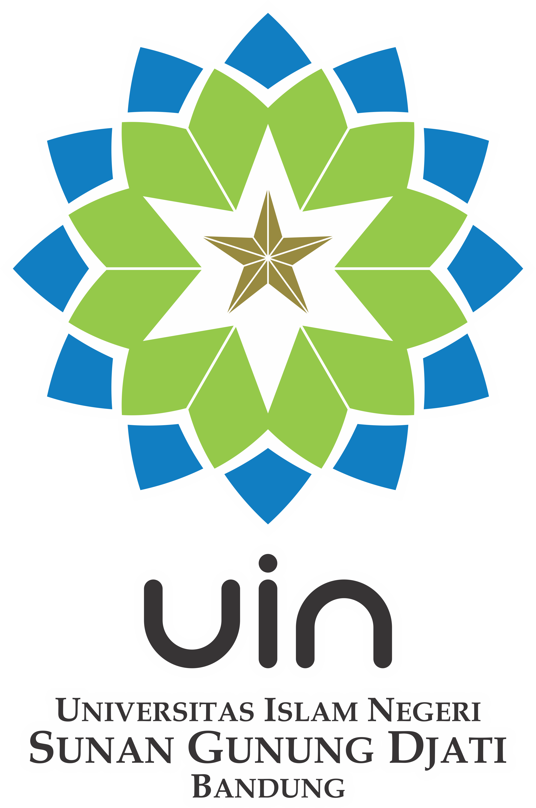
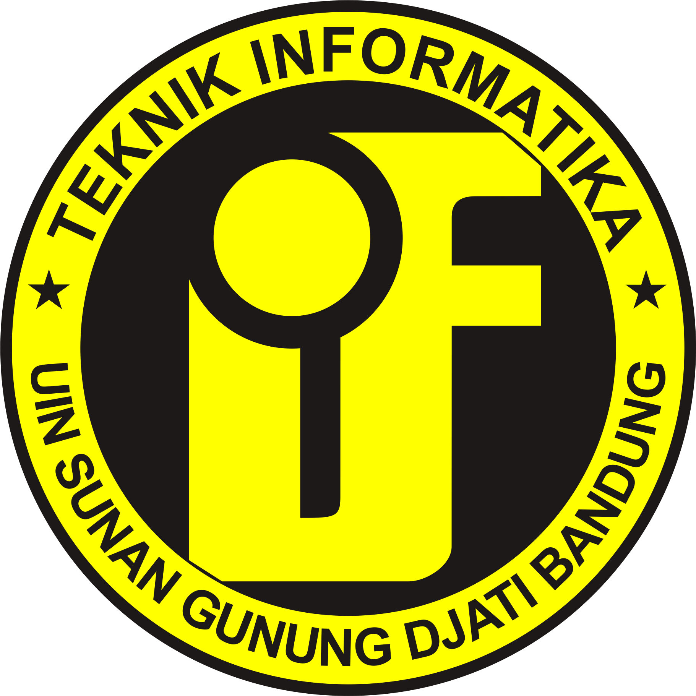

# Forklore

## Project Proposal Summary

### Team Members:
- Hisyam Arief Zulfani
- Muhammad Faisal Achramsyah
- Muhammad Gifa Algifari
- Muhammad Zidan

### UIN and IF Logo:

### Related SDGs Icons:

### Introduction:

### Team Profiles:
1. **Hisyam Arief Zulfani**
   - Roles: Writer/Researcher
   - Interests: As a writer and researcher dedicated to machine learning, I have a deep interest in the development and application of innovative artificial intelligence technologies. My main focus is exploring ways in which machine learning can be used to solve complex challenges and improve efficiency in different sectors.
   - Quote: "Teguh terhadap prinsip,setia terhadap proses"
   - Portfolio : -
   - LinkedIn : -
   - Github : [Link](https//github.com/zoelfanisyam)

2. **Muhammad Faisal Achramsyah**
   - Roles: Machine Learning Developer
   - Interests: Create model machine learning
   - Quote: “Error messages are the stepping stones to breakthroughs”
   - Portfolio : [Link](https://faisalach.github.io)
   - LinkedIn : [Link](https://www.linkedin.com/in/faisal-achramsyah-82b0b719b/)
   - Github : [Link](https://github.com/faisalach)

3. **Muhammad Gifa Algifari**
   - Roles: Data Engineer
   - Interests: As a data engineer, my job is to collect data from various sources, be it internal databases, external sources, APIs, or other tools. They also integrate fragmented data into one unified entity. I also collaborate with the team and continuously explore the latest innovations in this field.
   - Quote: "be useful wherever you are"
   - Portfolio : -
   - LinkedIn : [Link](www.linkedin.com/in/muhammad-zidan-fauzi-1b38042a5)
   - Github : [Link](https://github.com/gifaalgifari)
     
4. **Muhammad Zidan**
   - Roles: UI/UX Designer, Content Creative
   - Interests: Design UI/UX
   - Quote: "Life is showtime"
   - Portfolio : -
   - LinkedIn : [Link](www.linkedin.com/in/muhammad-zidan-fauzi-1b38042a5)
   - Github : [Link](https://github.com/ziohtime)

### Topic and Motivation:
Our project to recommend nutritious food that is good for health because of the large number of stunting cases in Indonesia. This project uses Content Based Filtering.

### Target User Group:
Our target is families and individuals who care about the problem of stunting in Indonesia, especially those who have children who are still small or are still growing. Those who do may have specific concerns about proper nutrition to support their children's growth and development.

### Proposed Solution:
First, collect data on foods, nutrition, and user preferences. After preprocessing the data to clean and organize it, develop Machine Learning models using algorithms such as Collaborative Filtering or Content-Based Filtering. Model validation is important to ensure accuracy before integrating it into user-accessible platforms. Finally, monitor and update the model periodically to maintain the quality of recommendations.

### Product Branding:
Forklore is an application that becomes a loyal companion in your journey towards a healthy life. Built with a focus on addressing stunting issues in Indonesia, Forklore presents nutritious food recommendations tailored to your needs. With advanced technology and guidance from the Quran and Hadith, Forklore helps you choose the right foods for optimal growth and good health.

### How This Project Relates to SDGs:
The collaboration between Forklore and the halal certification program at UIN Bandung promotes holistic health and facilitates users in accessing foods that align with nutritional and Islamic principles. This synergy supports a healthy and sustainable lifestyle, providing significant benefits to the community as a whole.

### Application Flow Chart:
[Insert Flow Chart Image]

### Application Design and Illustration:
[Insert Design and Illustration Images]

### Methods and Technologies Used:
- Content-Based Filtering
- Web Application

### Time Tables:
[Insert Time Table]

### References:
1. [Recipe-oriented Food Logging for Nutritional Management](https://doi.org/10.1145/3503161.3549203)
2. [Nutrition Garden - A gamified mobile app for motivating people to eat specific food to prevent non-communicable diseases](https://doi.org/10.1145/3608298.3608336)
3. [Exploring the Relationship Between COVID-19 Induced Economic Downturn and Women's Nutritional Health Disparities](https://doi.org/10.48550/arXiv.2311.12080)
4. [Boosting Healthiness Exposure in Category-constrained Meal Recommendation Using Nutritional Standards](https://doi.org/10.1145/3643859)
5. [Beyond Static Labels: Unpacking Nutrition Comprehension in the Digital Age](https://doi.org/10.1145/3613904.3642672)
6. [Automatic Classification of High vs. Low Individual Nutrition Literacy Levels from Loyalty Card Data in Switzerland](https://doi.org/10.1145/3552484.3555744)
7. [A Survey on Healthy Food Decision Influences Through Technological Innovations](https://doi.org/10.1145/3494580)
8. [Understanding Challenges for Developers to Create Accurate Privacy Nutrition Labels](https://doi.org/10.1145/3491102.3502012)
9. [Scale-Score: Food Label to Support Nutritious and Sustainable Online Grocery Shopping](https://doi.org/10.48550/arXiv.2309.03233)
10. [Scale-Score: Investigation of a Meta yet Multi-level Label to Support Nutritious and Sustainable Food Choices When Online Grocery Shopping](https://doi.org/10.48550/arXiv.2309.04024)

### Additional Pages:
Stay tuned for our short promotional video on Instagram! Follow our campaign [here](link).

---

* Repository URL: [Forklore GitHub Repository](https://github.com/faisalach/Forklore)
* Proposal URL: [Forklore Proposal](https://drive.google.com/file/d/1oUmFejxfHONYwCmtVkW8rrUaGkgflbfE/view?usp=sharing)

---

Feel free to adjust and customize this README.md according to your project's specific details and requirements!
